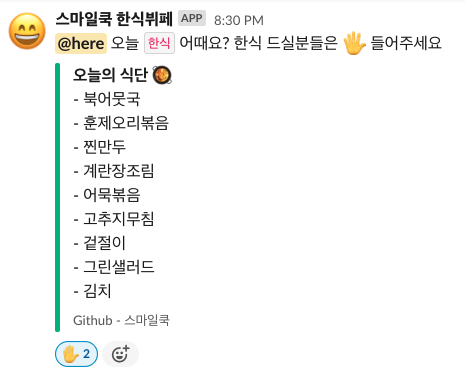

<!-- ALL-CONTRIBUTORS-BADGE:START - Do not remove or modify this section -->

<!-- ALL-CONTRIBUTORS-BADGE:END -->
# pangyo-smilecook   

- 스마일쿡은 `H스퀘어 S동 1층` 에 위치한 한식 뷔페입니다. 
- 우연히 들럿다가 제육이 나온다는 사실을 알고 제육이 나오는날 가기위해 만든 봇이에요.
- 여러분들이 식단을 `PR` 로 날려주시면 모두가 편하게 사용할 수 있을 것 같습니다. 
- 🍱 이제 판교 한식뷔페 스마일쿡 식단을 슬랙으로 받아보세요 

`Github Actions` 를 이용한 토이프로젝트 입니다.  
`Repository`를 `fork` 하신 후 아래와 같은 방법을 사용하시면 슬랙을 통해 매일 오전 메세지를 받으실 수 있습니다. 

# 식단 추가 기여하기 🥰

1. 식당 앞에 있는 식단표를 확인합니다.
2. `src/data` 디렉토리 내에 `YYYY-MM-DD.md` 형태로 파일을 생성하고 메뉴를 적어주신후 `PR` 날려주시면 됩니다. [예시보기](https://github.com/techinpark/pangyo-smilecook/pull/1)

- 기여하신 분들에게는 하단에 컨트리뷰터로 등록 해드리려고 합니다 🎈

# 사용법 📬

- 레포지토리를 `fork` 합니다.
- `Settings` - `Secrets` - `Add a new secret` 메뉴로 들어갑니다
- `WEBHOOKS` 라는 이름으로 슬랙의 `Incomming Webhook` 주소를 입력하여 저장합니다.
- 매일 아침 11시 메뉴가 슬랙으로 전송됩니다. 🎉

## Contributors ✨

Thanks goes to these wonderful people ([emoji key](https://allcontributors.org/docs/en/emoji-key)):

<!-- ALL-CONTRIBUTORS-LIST:START - Do not remove or modify this section -->
<!-- prettier-ignore-start -->
<!-- markdownlint-disable -->
<table>
  <tr>
    <td align="center"><a href="http://fernando.kr"> <b>Fernando</b></a> <a href="https://github.com/techinpark/pangyo-smilecook/commits?author=techinpark" title="Documentation">📖</a></td>
    <td align="center"><a href="http://heavybros.dothome.co.kr/"> <b>Haenala Shin</b></a> <a href="https://github.com/techinpark/pangyo-smilecook/commits?author=HaenaraShin" title="Documentation">📖</a></td>
  </tr>
</table>

<!-- markdownlint-enable -->
<!-- prettier-ignore-end -->
<!-- ALL-CONTRIBUTORS-LIST:END -->

This project follows the [all-contributors](https://github.com/all-contributors/all-contributors) specification. Contributions of any kind welcome!

hotfix-1 bugfix